# Godzilla Showdown

Visit site here : https://godzilla-week03-bintang-v05.netlify.app/

Welcome to Godzilla Showdown! This website repository showcases various Godzilla-type monsters and highlights their incredible power and ability. Whether you are a fan of giant monsters or just curious about the dynamics in the madness of Godzilla universe, this is the place for you.

## Table of Contents

- [Introduction](#introduction)
- [Features](#features)
- [Usage](#usage)
- [Workflow](#workflow)
- [Thanks](#thanks)

## Introduction

Motivated by the needs to be stronger amongs the kids, they often find Gozilla is unique creatures that have strong power and ability. Other than that Gozilla is also having mind blowing history. Let's dive in!

## Features

- **Monster Gallery:** Explore amazing collection of Godzilla with detailed information and images.
- **Strength Ratings:** Discover the strengths of each Godzilla, including their destructive power, agility, and unique abilities.

## Usage

1. Clone the repository:

   ```bash
   git clone https://github.com/RevoU-FSSE-4/module-2-bintangsenjapratama.git
   ```

2. Open the `index.html` file in your web browser ( Chrome is best )

3. Explore Godzilla type and their strengths.

## Workflow

1. I went to https://www.netlify.com/ and did sign up before, usually netlify will ask for github login info, so now I'm only need to login.
   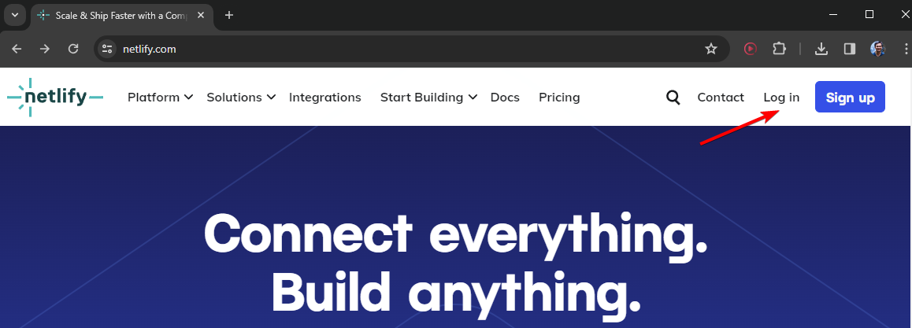

2. Connect Netlify to Github project repo by selecting "Add new site" and choose "Import an existing project"
   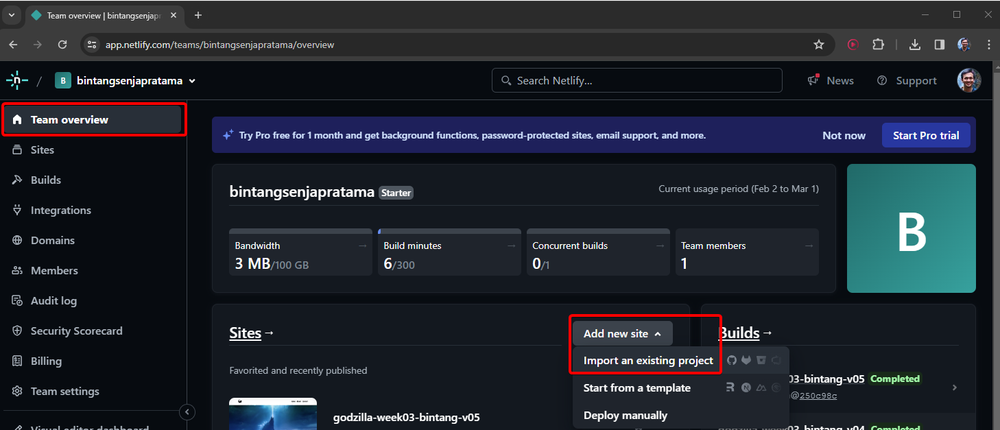

3. Choose "Deploy with Github"
   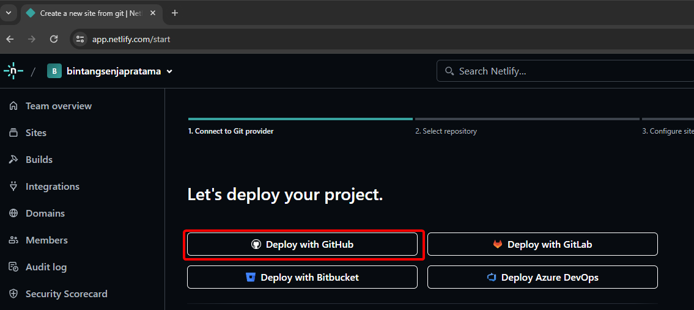

4. Choose RevoU-FSSE-4 repo
   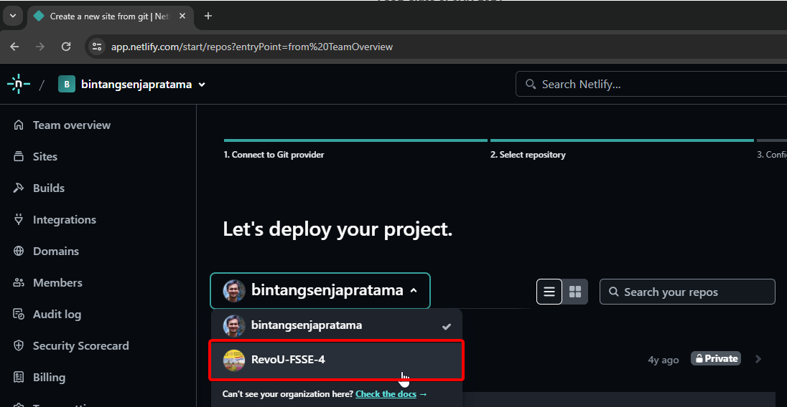

5. Choose module-2 repository
   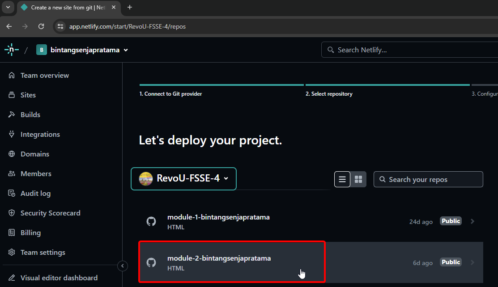

6. Fill site name and check availability
   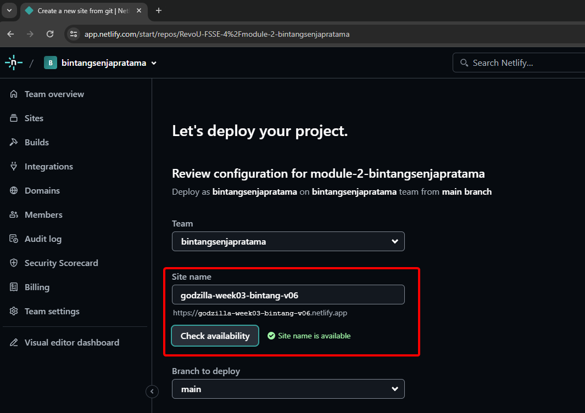

7. Branch to deploy is **main** in this case
   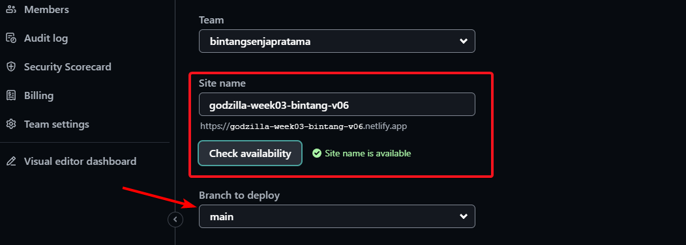

8. Then Deploy the site by pressing the button below that page
   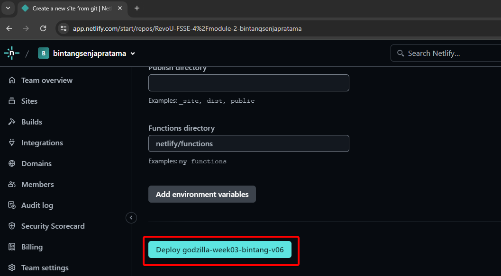

9. Now wait the deployment progress, when it is done, choose Setup Custom Domain
   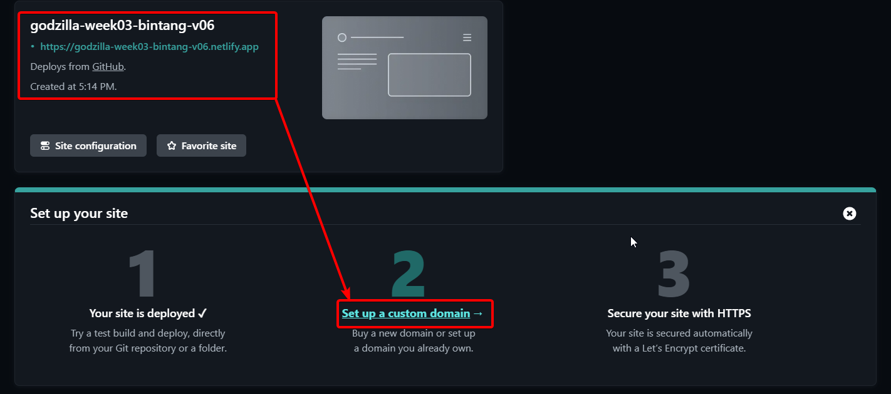

10. Type the custom domain name that was bought from niagahoster and press Verify
    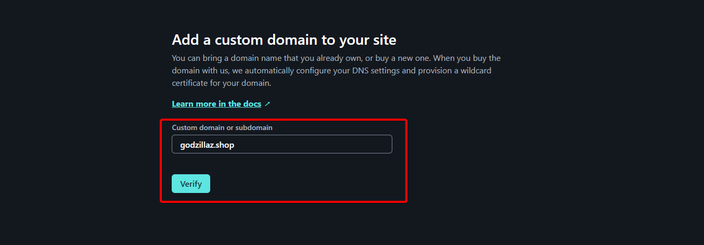

11. Depending on whether the domain can be registered or not through netlify, we can still add domain and then later on configure the Netlify DNS later.
    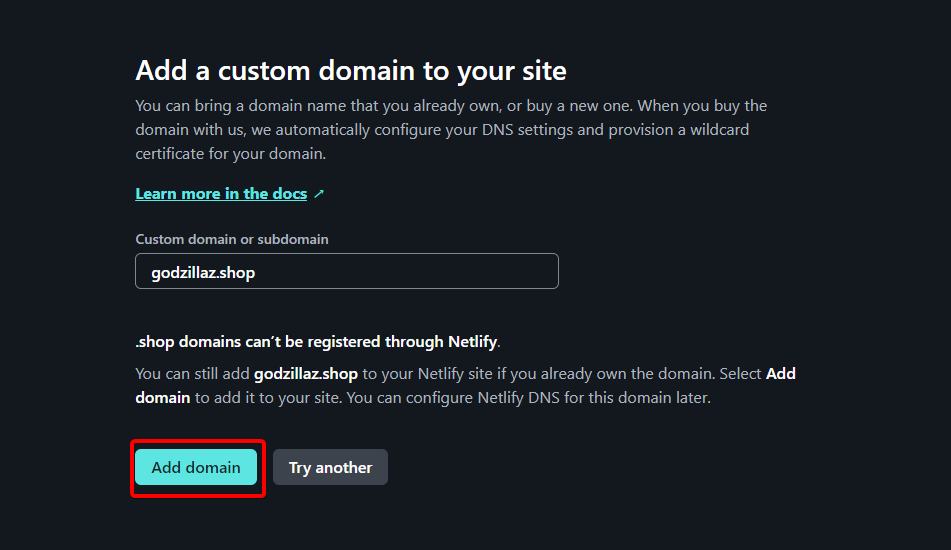

12. Click on Awaiting External DNS and copy those servers name to niagahoster
    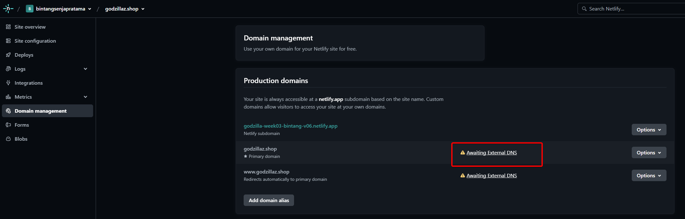

13. Copy those dns server to niagahoster dns nameservers
    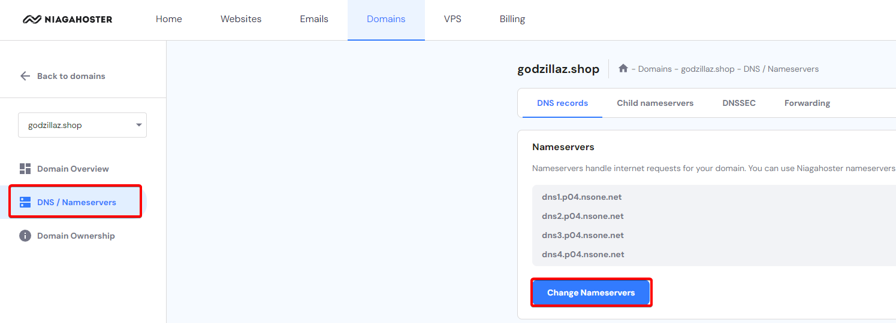

14. After Done wait until DNS on Netlify is setup using Netlify DNS, then the site will be up

## Thanks

Enjoy discovering the world of Godzilla with Godzilla Showdown!


